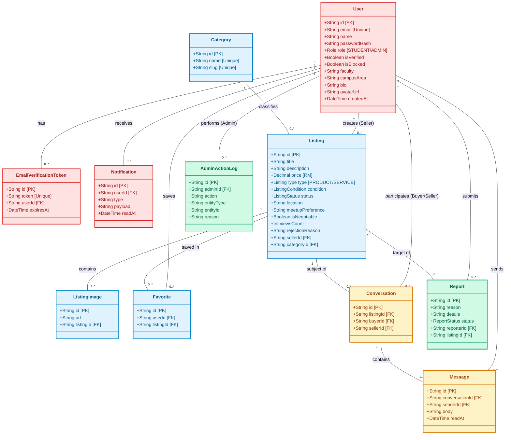

# 🗄️ IntiTrade: Архитектура Базы Данных и UML Диаграмма классов

В данном документе представлена подробная структура базы данных проекта **IntiTrade**, визуализированная в виде цветовой UML диаграммы классов. Структура полностью соответствует реальной схеме `schema.prisma` и использует цветовую кодировку по функциональным доменам для удобства восприятия разработчиками.

---

## 🎨 Цветовая легенда функциональных блоков

* 🔴 **Красный блок (Учетные записи и безопасность)**: `User`, `EmailVerificationToken`, `Notification`. Ответственность за профили студентов, проверку доменов университета и отправку уведомлений.
* 🔵 **Синий блок (Каталог и товары)**: `Listing`, `Category`, `ListingImage`, `Favorite`. Ответственность за маркетплейс, характеристики товаров (валюта **RM**, торг, состояние), категории и избранное.
* 🟡 **Желтый блок (Коммуникации и сделки)**: `Conversation`, `Message`. Ответственность за изолированные p2p-чаты по каждому отдельному товару.
* 🟢 **Зеленый блок (Модерация и аудит)**: `Report`, `AdminActionLog`. Ответственность за жалобы, безопасность кампуса и прозрачность действий администратора.

---

## 📊 UML Диаграмма классов Базы Данных (Mermaid)

---

## 🛠️ Описание ключевых связей и правил целостности

1. **Каскадное удаление (OnDelete: Cascade)**:
   * При удалении пользователя (`User`) автоматически удаляются все его токены верификации, избранные товары, уведомления и отправленные сообщения.
   * При удалении объявления (`Listing`) автоматически очищаются его фотографии (`ListingImage`), отметки в избранном и связанные диалоги.
2. **Уникальные индексы (Unique Constraints)**:
   * **`Favorite`**: Уникальный составной ключ `[userId, listingId]` предотвращает дублирование одного и того же товара в избранном у студента.
   * **`Conversation`**: Уникальный составной ключ `[listingId, buyerId, sellerId]` гарантирует, что между покупателем и продавцом по одному товару существует только один общий диалог.
3. **Оптимизация производительности (Indexes)**:
   * Настроены индексы по полям фильтрации `@@index([status, type])` в таблице `Listing` для мгновенной выборки объявлений в главной ленте маркетплейса.
